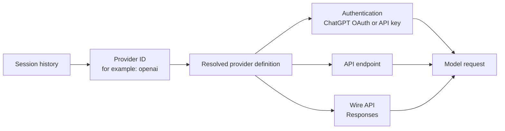

# Understanding Codex Providers

[简体中文](PROVIDERS_ZH.md)

A Codex provider is a **named runtime route**. It tells Codex which API protocol, endpoint, authentication policy, and related settings should handle a model request. It is not the session itself, an account, or a credential.



The distinction matters because a session normally persists the **provider ID**, while provider definitions and credentials live separately. Moving the session changes its provider reference. It does not copy the target definition, API key, OAuth state, base URL, or model aliases.

## The four layers

| Layer | Example | Where it lives | What a session move does |
|---|---|---|---|
| Provider ID | `openai`, `company-gateway` | Session metadata and Codex config | Changes the session reference |
| Provider definition | endpoint, protocol, retry settings | `config.toml` and built-in defaults | Not copied |
| Credentials | ChatGPT login or API key | Codex authentication storage or an external proxy | Not copied or backed up |
| Network route | OpenAI, a gateway, or a local switch proxy | Resolved at runtime | May differ by host and over time |

Provider IDs are case-sensitive. `openai` and `OpenAI` can name two different definitions and therefore two different routes.

## How Codex resolves a provider

Codex begins with built-in provider definitions and merges configured `[model_providers.<id>]` entries. The selected `model_provider` ID then resolves to one definition. Authentication mode and an explicit `base_url`, when present, determine the final network destination.

```toml
model_provider = "company-gateway"

[model_providers.company-gateway]
name = "Company Gateway"
base_url = "https://gateway.example.com/v1"
wire_api = "responses"
requires_openai_auth = true
```

Never place a real key in documentation or a session rollout. Provider configuration should describe the route; Codex authentication storage or the gateway should own the secret.

```mermaid
sequenceDiagram
    participant U as User resumes session
    participant S as Session store
    participant C as Codex config
    participant A as Auth store
    participant P as Provider endpoint
    U->>S: Read model_provider ID
    S-->>U: company-gateway
    U->>C: Resolve provider definition
    U->>A: Obtain required credential
    U->>P: Send Responses API request
    P-->>U: Model events and state
    U->>S: Append events; retain provider ID
```

## Built-in and configured providers

- `openai` is Codex's built-in OpenAI provider. Its effective endpoint depends on authentication mode unless a definition overrides it: ChatGPT authentication uses the Codex backend, while API-key authentication uses the OpenAI API.
- Configured providers add or replace definitions by exact ID. They commonly point to an organization gateway, a compatible API, or a local provider-switch proxy.
- Historical sessions can retain an ID that is no longer configured. Codex Transfer may still show that bucket because the ID exists in session history, but resuming it can fail until the definition is restored.

## Why the same ID can mean different things

Provider IDs are references, not immutable route snapshots. A provider named `company-gateway` may point to one URL on host A and another on host B. It may also point somewhere different next month after `config.toml` or a switching proxy changes.

```text
Host A session ── provider ID: company-gateway ──> Host A config ──> Gateway A
Host B session ── provider ID: company-gateway ──> Host B config ──> Gateway B
```

Therefore, a historical session proves which provider **ID** Codex recorded. It does not, by itself, prove the exact credential, upstream URL, account, or model implementation used for every turn.

## What this means for transfer

Before a Fork or Move, verify the target host independently:

1. The exact target provider ID exists, including letter case.
2. Its endpoint and wire protocol are the intended ones.
3. The target host has valid authentication.
4. Model aliases and required tools are available.
5. The session is not writer-locked.
6. You accept that encrypted reasoning and mixed-provider provenance may not be portable.

Prefer **Fork** for important sessions. It preserves the source while you test whether the target route can resume the copied history. A **Move** changes the original session's bucket and has stricter recovery constraints once new events are written.

Codex Transfer backs up session data and records provider IDs and hashes. It intentionally does not back up secrets. It also cannot reconstruct a perfect per-turn provider trace when the rollout did not record one.

## Inspecting a Provider in the workbench

Hover or keyboard-focus any Provider in the sidebar, the current route label, the target Provider selector, or a preflight route to inspect the Provider on that specific host. The popover shows the Provider ID and display name, sanitized endpoint, wire protocol, authentication method, configured capabilities, retry settings, observed models, Session counts, and configuration source.

The catalog is intentionally allowlisted. Credential values, bearer tokens, HTTP header values, and query-parameter values are never included in the browser response. URL user information, queries, and fragments are stripped before display. Environment-variable names and request metadata names may be shown, but their values are not.

## Inspecting your environment

Use read-only commands before changing anything:

```bash
ct hosts --json
ct status --host local --json
ct sessions --host local --provider openai --json
```

Then inspect the relevant host's Codex configuration directly. Treat a provider's current definition as current routing evidence, not definitive proof of its entire historical behavior.
