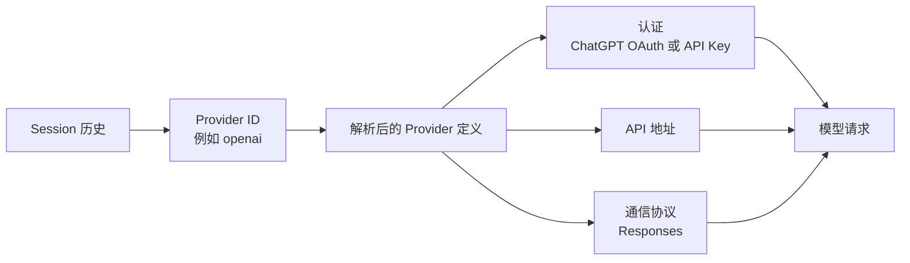
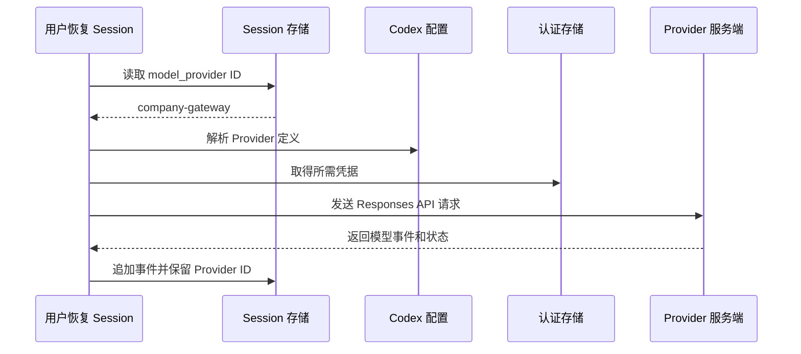

# 理解 Codex Provider

[English](PROVIDERS.md)

可以把 Codex Provider 理解为一条**有名字的运行时请求路线**：它告诉 Codex 用什么 API 协议、访问哪个地址、采用哪种认证策略，以及怎样把模型请求发出去。Provider 不是 Session 本身，不等于账号，也不等于凭据。



关键区别是：Session 通常只持久化 **Provider ID**，而 Provider 的具体定义和认证凭据分开保存。移动 Session 改变的是它引用的 Provider ID，不会复制目标 Provider 定义、API Key、OAuth 状态、Base URL 或模型别名。

## 四层心智模型

| 层次 | 例子 | 保存位置 | 移动 Session 时发生什么 |
|---|---|---|---|
| Provider ID | `openai`、`company-gateway` | Session 元数据与 Codex 配置 | 改变 Session 的引用 |
| Provider 定义 | 地址、协议、重试策略 | `config.toml` 和内置默认值 | 不复制 |
| 认证凭据 | ChatGPT 登录或 API Key | Codex 认证存储或外部代理 | 不复制、不备份 |
| 实际网络路线 | OpenAI、网关或本地切换代理 | 运行时解析 | 可能随主机和时间变化 |

Provider ID 区分大小写。`openai` 和 `OpenAI` 可以是两个完全不同的定义，最终走向两条不同的路线。

## Codex 如何解析 Provider

Codex 先加载内置 Provider，再合并 `[model_providers.<id>]` 配置。当前选中的 `model_provider` ID 会解析成一个具体定义；认证方式和显式配置的 `base_url` 共同决定最终网络出口。

```toml
model_provider = "company-gateway"

[model_providers.company-gateway]
name = "Company Gateway"
base_url = "https://gateway.example.com/v1"
wire_api = "responses"
requires_openai_auth = true
```

不要把真实密钥写进文档或 Session rollout。Provider 配置负责描述路线，密钥应由 Codex 的认证存储或网关保管。



## 内置 Provider 与自定义 Provider

- `openai` 是 Codex 内置的 OpenAI Provider。如果没有显式覆盖地址，它的有效出口取决于认证方式：ChatGPT 登录走 Codex backend，API Key 登录走 OpenAI API。
- 自定义 Provider 按精确 ID 增加或覆盖定义，常见用途是企业网关、兼容 API 或本地 Provider 切换代理。
- 历史 Session 可能保留一个已经从配置中删除的 ID。Codex Transfer 仍可能显示这个分组，因为历史中存在该 ID；但在恢复 Session 前必须重新提供有效定义。

## 为什么同名 Provider 不一定是同一条路线

Provider ID 是引用，不是不可变的路线快照。主机 A 上的 `company-gateway` 可以指向地址 A，主机 B 上的同名 Provider 可以指向地址 B。以后修改 `config.toml` 或切换代理上游后，同一 ID 还可能再次改变含义。

```text
主机 A Session ── Provider ID: company-gateway ──> 主机 A 配置 ──> 网关 A
主机 B Session ── Provider ID: company-gateway ──> 主机 B 配置 ──> 网关 B
```

因此，历史 Session 可以证明 Codex 当时记录了哪个 Provider **ID**，却不能单凭这个 ID 证明每一轮实际使用的凭据、上游地址、账号或模型实现。

## 这对迁移意味着什么

Fork 或 Move 之前，应在目标主机独立确认：

1. 目标 Provider ID 确实存在，并且大小写完全一致。
2. 它的地址和通信协议符合预期。
3. 目标主机已有有效认证。
4. 模型别名和所需工具可用。
5. Session 没有被 writer lock 占用。
6. 你接受加密推理和混合 Provider 来源可能无法移植或完整追溯。

重要 Session 应优先选择 **Fork**：源 Session 保持不变，可以先验证目标路线能否恢复复制后的历史。**Move** 会改变原 Session 的分组；一旦迁移后写入新事件，恢复条件会更严格。

Codex Transfer 会备份 Session 数据，并记录 Provider ID 与哈希；它有意不备份任何密钥。如果 rollout 没有可靠的逐轮 Provider 字段，它也无法凭空重建完整的逐轮来源。

## 在工作台查看 Provider 详情

鼠标悬浮或使用键盘聚焦左侧 Provider、当前路线标签、目标 Provider 下拉框以及预检路线，都可以查看该 Provider 在对应主机上的详情。小窗会显示 Provider ID 与名称、经过净化的 Endpoint、协议、认证方式、能力声明、重试设置、已观察模型、Session 数量和配置来源。

Provider Catalog 使用严格白名单。凭据值、Bearer Token、HTTP Header 值和查询参数值不会进入浏览器响应；URL 中的用户信息、Query 和 Fragment 会在显示前移除。界面可以显示环境变量名和请求元数据名称，但不会显示它们的值。

## 检查自己的环境

先用只读命令查看主机、Provider 和 Session：

```bash
ct hosts --json
ct status --host local --json
ct sessions --host local --provider openai --json
```

然后直接检查对应主机的 Codex 配置。当前 Provider 定义只能证明“现在会怎样路由”，不能自动成为全部历史行为的确证。
